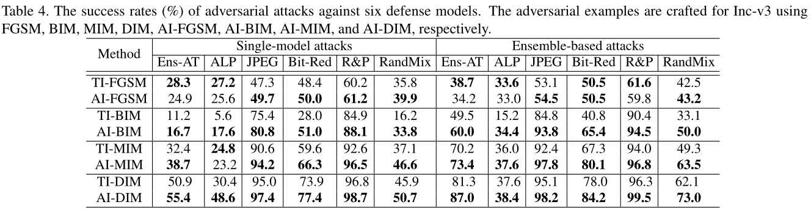

# Affine-Invariant Attacks

## Introduction
This repository contains the code for Affine-Invariant Attack method, and this repo is modified from [Translation-Invariant-Attacks](https://github.com/dongyp13/Translation-Invariant-Attacks).

## Method
We propose an Affine-Invariant adversarial attack (AI) which can consistently construct adversarial examples robust over a distribution of affine transformation including rotation, translation, and scaling. To further improve the efficiency of our algorithm, we propose to disentangle the affine transformation into the rotations, translations, magnifications. After reformulating the transformation in polar coordinate, we conduct the gradient estimation by convolving the gradient at the original image with derived kernels, which can be integrated with any gradient-based attack methods.

## Run the code
First download the [models](#Models). You can also use other models by changing the model definition part in the code.
Then run the following command
```
bash run_attack.sh input_dir output_dir 16
```
where original images are stored in ``input_dir`` with ``.png`` format, and the generated adversarial images are saved in ``output_dir``.
We used the Python 2.7 and Tensorflow 1.12 versions. Python 3.6 and Tensorflow 1.15 may also work.

## Results

### Performance over affine transformation


<div align=center>

</div>

### Transferability on defense models



## Visualization


## Implementation

### Models
The models can be downloaded at [Inception V3](https://jbox.sjtu.edu.cn/l/3Jv924), [Inception V4](https://jbox.sjtu.edu.cn/l/45eBjz), [Inception ResNet V2](https://jbox.sjtu.edu.cn/l/85O9rw), and [ResNet V2 152](https://jbox.sjtu.edu.cn/l/fJ6wlo).

If you want to attack other models, you can replace the model definition part to your own models.

### Hyper-parameters
* For AI-FGSM, set ``num_iter=1``, ``momentum=0.0``, ``prob=0.0``;
* For AI-BIM, set ``num_iter=10``, ``momentum=0.0``, ``prob=0.0``;
* For AI-MIM, set ``num_iter=10``, ``momentum=1.0``, ``prob=0.0``;
* For AI-DIM, set ``num_iter=10``, ``momentum=1.0``, ``prob=0.7``;

## Reference
[1] https://github.com/dongyp13/Translation-Invariant-Attacks \
[2] https://github.com/kevinzakka/spatial-transformer-network
